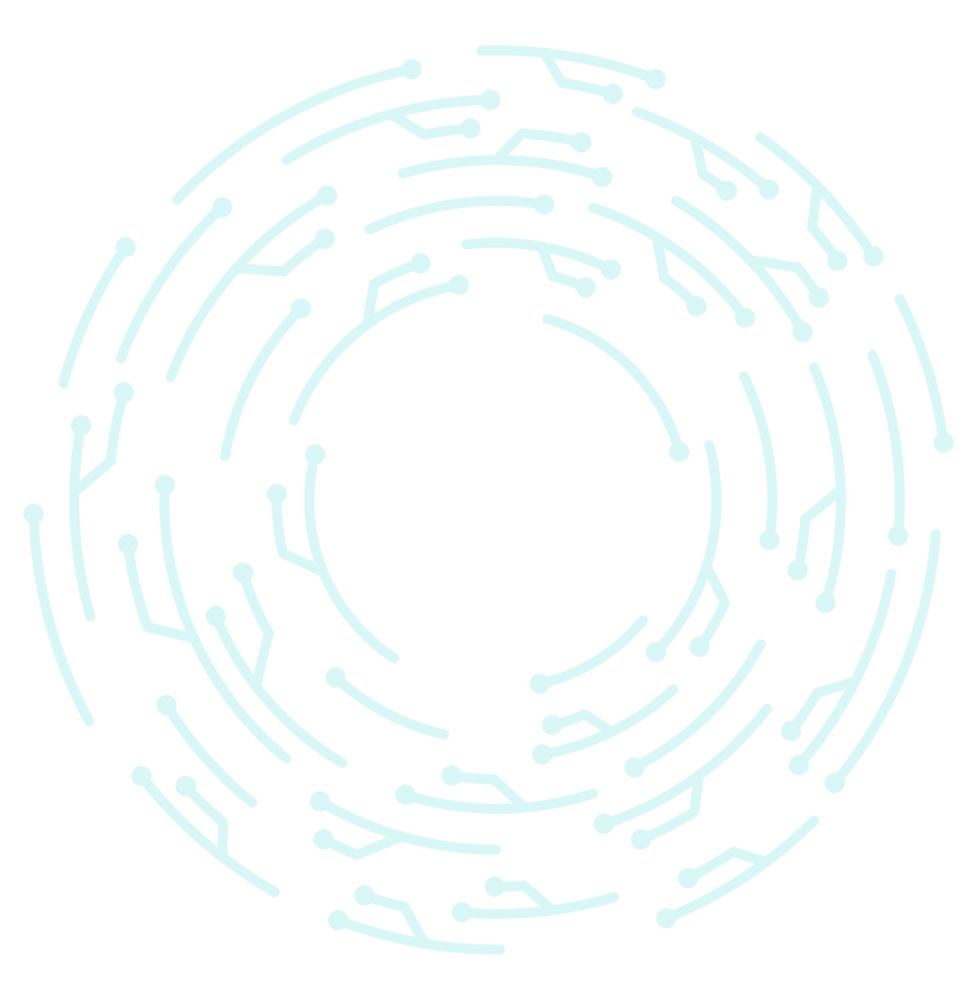

#############
Demo technote
#############

.. abstract::

   A *technote* is a web-native single page document that enables rapid technical communication within and across teams.

.. Three alphabets is a good guage for line length. We want to shoot for 2-3 alphabets.
.. abcdefghijklmnopqrstuvwxyzabcdefghijklmnopqrstuvwxyzabcdefghijklmnopqrstuvwxyz

Introduction
============

Lorem ipsum dolor sit amet, consectetur adipiscing elit. Proin facilisis pharetra neque, at semper nulla mattis auctor. Proin semper mollis enim eget interdum. Mauris eleifend eget diam vitae bibendum. Praesent ut aliquet odio, sodales imperdiet nisi. Nam interdum imperdiet tortor sed fringilla. [#]_ Maecenas efficitur mi sodales nulla commodo rutrum. Ut ornare diam quam, sed commodo turpis aliquam et. In nec enim consequat, suscipit tortor sit amet, luctus ante. Integer dictum augue diam, non pulvinar massa euismod in. Morbi viverra condimentum auctor. Nullam et metus mauris. Cras risus ex, porta sit amet nibh et, dapibus auctor leo.

Lorem ipsum dolor sit amet, consectetur adipiscing elit. Proin facilisis pharetra neque, at semper nulla mattis auctor. Proin semper mollis enim eget interdum. Mauris eleifend eget diam vitae bibendum. Praesent ut aliquet odio, sodales imperdiet nisi. Nam interdum imperdiet tortor sed fringilla. Maecenas efficitur mi sodales nulla commodo rutrum. Ut ornare diam quam, sed commodo turpis aliquam et. In nec enim consequat, suscipit tortor sit amet, luctus ante. Integer dictum augue diam, non pulvinar massa euismod in. Morbi viverra condimentum auctor. Nullam et metus mauris. Cras risus ex, porta sit amet nibh et, dapibus auctor leo.

Lorem ipsum [Ref]_ dolor sit amet.

.. [Ref] Book or article reference, URL or whatever.

Here is a quote:

   This is a quote.

   It can span multiple paragraphs.

Quotes with attribution:

   This is a quote.

   It can span multiple paragraphs.

   -- The Developer

An epigraph:

.. epigraph::

   This is an epigraph.

   -- The Developer

.. [#] Footnote text. Lorem ipsum dolor sit amet, consectetur adipiscing elit. Proin facilisis pharetra neque, at semper nulla mattis auctor. Proin semper mollis enim eget interdum. Mauris eleifend eget diam vitae bibendum. Praesent ut aliquet odio, sodales imperdiet nisi. Nam interdum imperdiet tortor sed fringilla. Maecenas efficitur mi sodales nulla commodo rutrum. Ut ornare diam quam, sed commodo turpis aliquam et. In nec enim consequat, suscipit tortor sit amet, luctus ante. Integer dictum augue diam, non pulvinar massa euismod in. Morbi viverra condimentum auctor. Nullam et metus mauris. Cras risus ex, porta sit amet nibh et, dapibus auctor leo.

Method
======

Lorem ipsum dolor sit amet, consectetur adipiscing elit. Proin facilisis pharetra neque, at semper nulla mattis auctor. Proin semper mollis enim eget interdum. Mauris eleifend eget diam vitae bibendum. Praesent ut aliquet odio, sodales imperdiet nisi. Nam interdum imperdiet tortor sed fringilla. Maecenas efficitur mi sodales nulla commodo rutrum. Ut ornare diam quam, sed commodo turpis aliquam et. In nec enim consequat, suscipit tortor sit amet, luctus ante. Integer dictum augue diam, non pulvinar massa euismod in. Morbi viverra condimentum auctor. Nullam et metus mauris. Cras risus ex, porta sit amet nibh et, dapibus auctor leo.

A list:

- First item
- Second item
- Third item

Lorem ipsum dolor sit amet, consectetur adipiscing elit. Proin facilisis pharetra neque, at semper nulla mattis auctor. Proin semper mollis enim eget interdum. Mauris eleifend eget diam vitae bibendum. Praesent ut aliquet odio, sodales imperdiet nisi. Nam interdum imperdiet tortor sed fringilla. Maecenas efficitur mi sodales nulla commodo rutrum. Ut ornare diam quam, sed commodo turpis aliquam et. In nec enim consequat, suscipit tortor sit amet, luctus ante. Integer dictum augue diam, non pulvinar massa euismod in. Morbi viverra condimentum auctor. Nullam et metus mauris. Cras risus ex, porta sit amet nibh et, dapibus auctor leo.

.. code-block:: python
   :caption: hello.py

   print("Hello world")

Code cells
==========

Lorem ipsum dolor sit amet, consectetur adipiscing elit. Proin facilisis pharetra neque, at semper nulla mattis auctor. ``inline code`` to test line height behaviour. Proin ``hello world`` facilisis pharetra neque, at semper nulla mattis auctor. `pathlib.Path`. Proin facilisis pharetra neque, at semper nulla mattis auctor.

This is a long code cell:

.. code-block:: Makefile
   :caption: Makefile

   .PHONY: update-deps
   update-deps:
   	pip install --upgrade pip-tools pip setuptools
   	pip-compile --upgrade --build-isolation --generate-hashes --output-file server/requirements/main.hashed.txt server/requirements/main.in
   	pip-compile --upgrade --build-isolation --generate-hashes --output-file server/requirements/dev.hashed.txt server/requirements/dev.in
   	pip-compile --upgrade --build-isolation --allow-unsafe --output-file server/requirements/main.txt server/requirements/main.in
   	pip-compile --upgrade --build-isolation --allow-unsafe --output-file server/requirements/dev.txt server/requirements/dev.in

   .PHONY: init
   init:
   	pip install --editable "./client[dev]"
   	pip install --editable ./server
   	pip install --upgrade -r server/requirements/main.txt -r server/requirements/dev.txt
   	rm -rf ./server.tox
   	pip install --upgrade pre-commit tox
   	pre-commit install

   .PHONY: update
   update: update-deps init

   .PHONY: run
   run:
   	cd server && tox run -e=run

A code cell without a caption:

.. code-block:: python

   print("Hello world")

A code sample with no language set::

   Hello world

A wide code sample with no caption:

.. code-block:: Makefile

   .PHONY: update-deps
   update-deps:
   	pip install --upgrade pip-tools pip setuptools
   	pip-compile --upgrade --build-isolation --generate-hashes --output-file server/requirements/main.hashed.txt server/requirements/main.in
   	pip-compile --upgrade --build-isolation --generate-hashes --output-file server/requirements/dev.hashed.txt server/requirements/dev.in
   	pip-compile --upgrade --build-isolation --allow-unsafe --output-file server/requirements/main.txt server/requirements/main.in
   	pip-compile --upgrade --build-isolation --allow-unsafe --output-file server/requirements/dev.txt server/requirements/dev.in

Admonitions
===========

Some content.

.. attention::

   This is an attention notice.

More content.

.. caution::

   This is a caution:

   - First item
   - Second item
   - Third item

.. danger::

   This is a danger notice.

.. error::

   This is an error.

.. hint::

   This is a hint.

.. important::

   This is important.

.. note::

   This is a note.

.. tip::

   This is a tip.

.. warning::

   This is a warning.

Lists
=====

A compact list (default):

- First item
- Second item

  - First child item
  - Second child item

- Third item

An unordered list with long content using the ``block-list`` class:

.. rst-class:: block-list

- Lorem ipsum dolor sit amet, consectetur adipiscing elit. Proin facilisis pharetra neque, at semper nulla mattis auctor. Proin semper mollis enim eget interdum. Mauris eleifend eget diam vitae bibendum. Praesent ut aliquet odio, sodales imperdiet nisi. Nam interdum imperdiet tortor sed fringilla.

- Lorem ipsum dolor sit amet, consectetur adipiscing elit. Proin facilisis pharetra neque, at semper nulla mattis auctor. Proin semper mollis enim eget interdum. Mauris eleifend eget diam vitae bibendum. Praesent ut aliquet odio, sodales imperdiet nisi. Nam interdum imperdiet tortor sed fringilla.

  - First child item

  - Second child item

- Lorem ipsum dolor sit amet, consectetur adipiscing elit. Proin facilisis pharetra neque, at semper nulla mattis auctor. Proin semper mollis enim eget interdum. Mauris eleifend eget diam vitae bibendum. Praesent ut aliquet odio, sodales imperdiet nisi. Nam interdum imperdiet tortor sed fringilla.

A compact ordered list:

#. First item
#. Second item

   #. First child item
   #. Second child item

#. Third item

An ordered list with long content using the ``block-list`` class:

.. rst-class:: block-list

#. Lorem ipsum dolor sit amet, consectetur adipiscing elit. Proin facilisis pharetra neque, at semper nulla mattis auctor. Proin semper mollis enim eget interdum. Mauris eleifend eget diam vitae bibendum. Praesent ut aliquet odio, sodales imperdiet nisi. Nam interdum imperdiet tortor sed fringilla.

#. Lorem ipsum dolor sit amet, consectetur adipiscing elit. Proin facilisis pharetra neque, at semper nulla mattis auctor. Proin semper mollis enim eget interdum. Mauris eleifend eget diam vitae bibendum. Praesent ut aliquet odio, sodales imperdiet nisi. Nam interdum imperdiet tortor sed fringilla.

   #. First child item

   #. Second child item

#. Lorem ipsum dolor sit amet, consectetur adipiscing elit. Proin facilisis pharetra neque, at semper nulla mattis auctor. Proin semper mollis enim eget interdum. Mauris eleifend eget diam vitae bibendum. Praesent ut aliquet odio, sodales imperdiet nisi. Nam interdum imperdiet tortor sed fringilla.

A definition list:

term
   This is a definition.

term
   This is a definition.

   It can span multiple paragraphs.

Figures
=======

.. figure:: https://placehold.co/600x400/000000/FFFFFF.png
   :alt: A placeholder image
   :name: fig-placeholder

   This is an image.

This is a large figure:

This is a large image:

Referencing a figure: :numref:`fig-placeholder`.

Tables
======

.. These examples are from https://sphinx-themes.org/

Grid Tables
-----------

Here's a grid table followed by a simple table:

+------------------------+------------+----------+----------+
| Header row, column 1   | Header 2   | Header 3 | Header 4 |
| (header rows optional) |            |          |          |
+========================+============+==========+==========+
| body row 1, column 1   | column 2   | column 3 | column 4 |
+------------------------+------------+----------+----------+
| body row 2             | Cells may span columns.          |
+------------------------+------------+---------------------+
| body row 3             | Cells may  | - Table cells       |
+------------------------+ span rows. | - contain           |
| body row 4             |            | - body elements.    |
+------------------------+------------+----------+----------+
| body row 5             | Cells may also be     |          |
|                        | empty: ``-->``        |          |
+------------------------+-----------------------+----------+

=====  =====  ======
   Inputs     Output
------------  ------
  A      B    A or B
=====  =====  ======
False  False  False
True   False  True
False  True   True
True   True   True
=====  =====  ======

Giant Tables
^^^^^^^^^^^^

+------------+------------+-----------+------------+------------+-----------+------------+------------+-----------+------------+------------+-----------+
| Header 1   | Header 2   | Header 3  | Header 1   | Header 2   | Header 3  | Header 1   | Header 2   | Header 3  | Header 1   | Header 2   | Header 3  |
+============+============+===========+============+============+===========+============+============+===========+============+============+===========+
| body row 1 | column 2   | column 3  | body row 1 | column 2   | column 3  | body row 1 | column 2   | column 3  | body row 1 | column 2   | column 3  |
+------------+------------+-----------+------------+------------+-----------+------------+------------+-----------+------------+------------+-----------+
| body row 1 | column 2   | column 3  | body row 1 | column 2   | column 3  | body row 1 | column 2   | column 3  | body row 1 | column 2   | column 3  |
+------------+------------+-----------+------------+------------+-----------+------------+------------+-----------+------------+------------+-----------+
| body row 1 | column 2   | column 3  | body row 1 | column 2   | column 3  | body row 1 | column 2   | column 3  | body row 1 | column 2   | column 3  |
+------------+------------+-----------+------------+------------+-----------+------------+------------+-----------+------------+------------+-----------+
| body row 1 | column 2   | column 3  | body row 1 | column 2   | column 3  | body row 1 | column 2   | column 3  | body row 1 | column 2   | column 3  |
+------------+------------+-----------+------------+------------+-----------+------------+------------+-----------+------------+------------+-----------+

Table containing code
---------------------

==================================== ===========================================
Version                              Installing
==================================== ===========================================
Pradyun's pip fork and installer     .. code-block:: bash

                                        pip install "pip @ git+https://github.com/pradyunsg/pip#20.3.3" "installer @ git+https://github.com/pradyunsg/installer"

PyPI                                 .. code-block:: bash

                                        pip install pip installer

==================================== ===========================================

List Tables
-----------

.. list-table:: List tables can have captions like this one.
    :widths: 10 5 10 50
    :header-rows: 1
    :stub-columns: 1

    * - List table
      - Header 1
      - Header 2
      - Header 3 long. Lorem ipsum dolor sit amet, consectetur adipiscing elit. Nam sit amet mauris arcu.
    * - Stub Row 1
      - Row 1
      - Column 2
      - Column 3 long. Lorem ipsum dolor sit amet, consectetur adipiscing elit. Nam sit amet mauris arcu.
    * - Stub Row 2
      - Row 2
      - Column 2
      - Column 3 long. Lorem ipsum dolor sit amet, consectetur adipiscing elit. Nam sit amet mauris arcu.
    * - Stub Row 3
      - Row 3
      - Column 2
      - Column 3 long. Lorem ipsum dolor sit amet, consectetur adipiscing elit. Nam sit amet mauris arcu.

.. list-table:: This is a list table with images in it.

    * - .. figure:: https://source.unsplash.com/200x200/daily?cute+puppy

           This is a short caption for a figure.

      - .. figure:: https://source.unsplash.com/200x200/daily?cute+puppy

           This is a long caption for a figure. Lorem ipsum dolor sit amet, consectetur adipiscing elit.
           Donec porttitor dolor in odio posuere, vitae ornare libero mattis. In lobortis justo vestibulum nibh aliquet, non.

Results
=======

Lorem ipsum dolor sit amet, consectetur adipiscing elit. Proin facilisis pharetra neque, at semper nulla mattis auctor. Proin semper mollis enim eget interdum. Mauris eleifend eget diam vitae bibendum. Praesent ut aliquet odio, sodales imperdiet nisi. Nam interdum imperdiet tortor sed fringilla. Maecenas efficitur mi sodales nulla commodo rutrum. Ut ornare diam quam, sed commodo turpis aliquam et. In nec enim consequat, suscipit tortor sit amet, luctus ante. Integer dictum augue diam, non pulvinar massa euismod in. Morbi viverra condimentum auctor. Nullam et metus mauris. Cras risus ex, porta sit amet nibh et, dapibus auctor leo.

Subsection
----------

Lorem ipsum dolor sit amet, consectetur adipiscing elit. Proin facilisis pharetra neque, at semper nulla mattis auctor. Proin semper mollis enim eget interdum. Mauris eleifend eget diam vitae bibendum. Praesent ut aliquet odio, sodales imperdiet nisi. Nam interdum imperdiet tortor sed fringilla. Maecenas efficitur mi sodales nulla commodo rutrum. Ut ornare diam quam, sed commodo turpis aliquam et. In nec enim consequat, suscipit tortor sit amet, luctus ante. Integer dictum augue diam, non pulvinar massa euismod in. Morbi viverra condimentum auctor. Nullam et metus mauris. Cras risus ex, porta sit amet nibh et, dapibus auctor leo.

Subsubsection
^^^^^^^^^^^^^

Lorem ipsum dolor sit amet, consectetur adipiscing elit. Proin facilisis pharetra neque, at semper nulla mattis auctor. Proin semper mollis enim eget interdum. Mauris eleifend eget diam vitae bibendum. Praesent ut aliquet odio, sodales imperdiet nisi. Nam interdum imperdiet tortor sed fringilla. Maecenas efficitur mi sodales nulla commodo rutrum. Ut ornare diam quam, sed commodo turpis aliquam et. In nec enim consequat, suscipit tortor sit amet, luctus ante. Integer dictum augue diam, non pulvinar massa euismod in. Morbi viverra condimentum auctor. Nullam et metus mauris. Cras risus ex, porta sit amet nibh et, dapibus auctor leo.

Second child subsubsection
^^^^^^^^^^^^^^^^^^^^^^^^^^

Lorem ipsum dolor sit amet, consectetur adipiscing elit. Proin facilisis pharetra neque, at semper nulla mattis auctor. Proin semper mollis enim eget interdum. Mauris eleifend eget diam vitae bibendum. Praesent ut aliquet odio, sodales imperdiet nisi. Nam interdum imperdiet tortor sed fringilla. Maecenas efficitur mi sodales nulla commodo rutrum. Ut ornare diam quam, sed commodo turpis aliquam et. In nec enim consequat, suscipit tortor sit amet, luctus ante. Integer dictum augue diam, non pulvinar massa euismod in. Morbi viverra condimentum auctor. Nullam et metus mauris. Cras risus ex, porta sit amet nibh et, dapibus auctor leo.

Third child subsubsection
^^^^^^^^^^^^^^^^^^^^^^^^^

Lorem ipsum dolor sit amet, consectetur adipiscing elit. Proin facilisis pharetra neque, at semper nulla mattis auctor. Proin semper mollis enim eget interdum. Mauris eleifend eget diam vitae bibendum. Praesent ut aliquet odio, sodales imperdiet nisi. Nam interdum imperdiet tortor sed fringilla. Maecenas efficitur mi sodales nulla commodo rutrum. Ut ornare diam quam, sed commodo turpis aliquam et. In nec enim consequat, suscipit tortor sit amet, luctus ante. Integer dictum augue diam, non pulvinar massa euismod in. Morbi viverra condimentum auctor. Nullam et metus mauris. Cras risus ex, porta sit amet nibh et, dapibus auctor leo.

Another subsection
------------------

Analysis
========

Lorem ipsum dolor sit amet, consectetur adipiscing elit. Proin facilisis pharetra neque, at semper nulla mattis auctor. Proin semper mollis enim eget interdum. Mauris eleifend eget diam vitae bibendum. Praesent ut aliquet odio, sodales imperdiet nisi. Nam interdum imperdiet tortor sed fringilla. Maecenas efficitur mi sodales nulla commodo rutrum. Ut ornare diam quam, sed commodo turpis aliquam et. In nec enim consequat, suscipit tortor sit amet, luctus ante. Integer dictum augue diam, non pulvinar massa euismod in. Morbi viverra condimentum auctor. Nullam et metus mauris. Cras risus ex, porta sit amet nibh et, dapibus auctor leo.

Conclusion
==========

Lorem ipsum dolor sit amet, consectetur adipiscing elit. Proin facilisis pharetra neque, at semper nulla mattis auctor. Proin semper mollis enim eget interdum. Mauris eleifend eget diam vitae bibendum. Praesent ut aliquet odio, sodales imperdiet nisi. Nam interdum imperdiet tortor sed fringilla. Maecenas efficitur mi sodales nulla commodo rutrum. Ut ornare diam quam, sed commodo turpis aliquam et. In nec enim consequat, suscipit tortor sit amet, luctus ante. Integer dictum augue diam, non pulvinar massa euismod in. Morbi viverra condimentum auctor. Nullam et metus mauris. Cras risus ex, porta sit amet nibh et, dapibus auctor leo.
